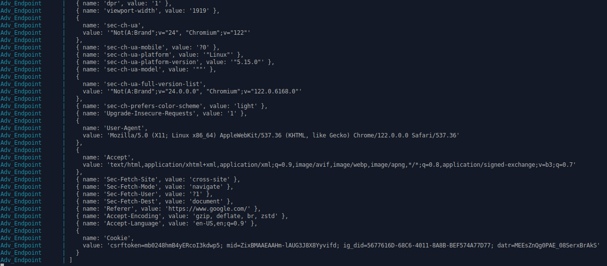
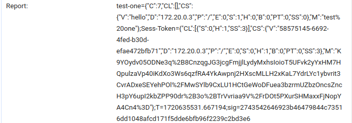

# CREAM

Cookies maintain state across related web traffic. As such, cookies are commonly used for authentication by storing a user's session ID and replacing the need to re-enter credentials in subsequent traffic. Due to this, these ''session cookies'' are prime targets for attacks such as Session Hijacking and Session Fixation which aim to steal them to gain unauthorized access to user accounts. To mitigate these attacks, the `Secure` and `HttpOnly` cookie attributes limit a cookie's accessibility from malicious networks and websites. However, these controls overlook browser extensions: third-party HTML/JavaScript add-ons with access to privileged browser APIs and the ability to operate across multiple websites. Thus a malicious or compromised extension can provide unrestricted access to a user's session cookies. 

In this work, we first analyze the prevalence of extensions with access to ''risky'' APIs (those that enable cookie modification and theft) and find that they have hundreds of millions of users. Motivated by this, we propose a mechanism to protect cookies from malicious extensions by introducing two new cookie attributes: `BrowserOnly` and `Monitored`. The `BrowserOnly` attribute prevents extensions access to cookies altogether. While effective, not all cookies can be made inaccessible. Thus cookies with the `Monitored` attribute remain accessible but are tied to a single browser and any changes made to the cookie by extensions are logged. As a result, stolen `Monitored` cookies are unusable outside their original browser and servers can validate the modifications performed. To demonstrate the proposed functionalities, we design and implement CREAM (**C**ookie **R**estrictions for **E**xtension **A**buse **M**itigation) as an open-source modified version of the Chromium browser realizing these controls. Our evaluation indicates that CREAM effectively protects cookies from malicious extensions while incurring little run-time overheads.

## Directory Structure 

    ├── chromium_files
    |   ├── chrome
    |   |   └── browser
    |   |       └── extensions
    |   |           └── api 
    |   |               └── cookies
    │   ├── net
    |   |   ├── cookies
    |   |   ├── log
    |   |   └── url_request
    │   └── services
    |       └── network
    |           └── public
    |               ├── cpp
    |               └── mojom
    ├── extension_scrape
    │   ├── manifests
    |   |   ├── Apps
    |   |   |   ├── chrome
    |   |   └── Extensions
    |   |       ├── android
    |   |       ├── chrome
    |   |       └── firefox
    │   └── permissions
    │       ├── Android
    |       |   └── all_urls
    │       ├── Apps
    |       |   └── all_urls
    │       ├── Chrome_extensions
    |       |   └── all_urls
    │       └── Firefox_extensions
    |           └── all_urls
    ├── img
    ├── test_extensions
    │   ├── cookie
    │   ├── cookie_firefox
    |   |   ├── v2
    |   |   └── v3
    │   ├── declarative_net_request
    |   ├── declarative_net_request_firefox
    |   ├── web_request
    |   └── web_request_firefox
    |       ├── v2
    |       └── v3
    └── test_network        
        ├── adv_endpoint
        ├── mysql_db
        ├── node_server
        |   └── html
        └── simple_server
            └── HTML

### Further Details

 - chromium_files - This directory only has the files changed to enable both attributes. This directory mimics the actual directory structure of Chromium to help highlight which files were changed.
 - extension_scrape - Contains the results of our web scrapes. This directory has the list of extensions discovered (per category), manifests, and permission splits used in the paper.
 - test_extensions - Contains the malicious extensions used in our case study divided by browser.
 - test_network - Contains a docker network for testing the new cookie attributes and behaviors.

## Setting Up the Chromium Prototype

We implemented the `BrowserOnly` and `Monitored` attributes in Chromium Version 122.0.6168.0. The installation instructions for Chromium can be found on the Chromium Docs server [here](https://chromium.googlesource.com/chromium/src/+/main/docs/linux/build_instructions.md). However, Chromium has been updated many times since we first began working on the prototype. While the general design of the `BrowserOnly` and `Monitored` attributes will work in these updated versions, the internal structure of Chromium has changed. As such our implementation will not work in these newer builds. Due to this, it is necessary to revert to an older build of Chromium for testing. Those instructions can also be found on the Chromium Docs site [here](https://chromium.googlesource.com/chromium/src/+/main/docs/building_old_revisions.md), but for ease of installation, we will describe the exact process below. It is important to note that these instructions are for Chromium on Linux. Instructions for other operating systems can be found [here](https://chromium.googlesource.com/chromium/src/+/main/docs/get_the_code.md).

### System Requirments

We built our prototype on an Ubuntu 20.04 machine running at 3.70 GHz with 32GB of RAM. In general, installing and building Chromium requires:
  
  - A 64-bit Intel machine
  - 8GB of RAM (16GB+ is recommended)
  - At least 100GB of disk space
  - Git
  - Python v3.8+

### Getting Chromium

#### Install `depot_tools`

Before downloading Chromium, you must first clone the `depot_tools` repository as follows:

    git clone https://chromium.googlesource.com/chromium/tools/depot_tools.git

This repository contains many commands needed to pull, configure, build, and run Chromium. Once `depot_tools` has been successfully cloned, you need to add the directory to your `PATH` as follows:

    export PATH="path/to/depot_tools:$PATH"

For safety, if `depot_tools` is in your home directory either use `${HOME}/depot_tools` or the full path when setting `PATH`. Also, note that you will need to add `depot_tools` to the `PATH` each time you open a new terminal.

#### Clone Chromium

Now that you have the appropriate tools, you will need to clone chromium. First Navigate to the directory you want to store Chromium in. Once there, pull the current build of Chromium using: 

    fetch --nohooks chromium

As Chromium is very large, the amount of time it takes to clone can vary from 30 minutes to several hours. In our tests, this step took around 45~50 minutes on average. Once downloaded navigate to the `src` directory:

    cd src

#### Installing Chromium Dependencies

Now that you have downloaded Chromium, you need to install its dependencies. To do so run the following from the `src` directory:

    ./build/install-build-deps.sh

Once finished, you will also need to download additional Chromium companion binaries by running:

     gclient runhooks

As an aside, we have occasionally seen the terminal hang when running this command. If this occurs, pressing enter should cause the download to continue.

#### Building Chromium (**OPTIONAL**)

Once all the dependencies are pulled you will be able to build and run the most recent version of Chromium. You can complete this process to test that Chromium has been pulled correctly, however, as CREAM relies on an older Chromium build you do not need to complete these steps yet. If you do want to test your installation, you will first need to create your build directory. To create the directory run:

    gn gen out/Default

This command will create the directory and generate all the necessary `.ninja` files for building Chromium. Once created, build Chromium by running:

    autoninja -C out/Default chrome

As this is the first time building Chromium, it must compile the entire browser. You may want to run this overnight or during the day when you aren't at your machine as this process is very resource intensive and will take several hours. After building Chromium, you can run the browser with the following command:

    out/Default/chrome

### Reverting Chromium

Once Chromium has been pulled (and optionally built), you will need to roll back to version 122.0.6168.0.

#### Reverting `depot_tools` (**If Necessary**)

At the time of writing, the current version of `depot_tools` was compatible with Chromium 122.0.6168.0. However, if you encounter an issue with any `depot_tools`'s commands later in the process, you may need to roll back to an earlier build of the tools. To do this navigate to the `depot_tools` directory and run the following commands:

    git checkout $(git rev-list -n 1 --before="2023-12-05 18:51:43 +0000" main)
    export DEPOT_TOOLS_UPDATE=0

This will roll the tools back to the original version used when developing CREAM. Setting `DEPOT_TOOLS_UPDATE=0` prevents later steps in the process from updating `depot_tools` back to the current version. 

#### Revert Chromium

Navigate back to the `src` directory of your Chromium build. Once there run:

    git checkout e8021bfdbefe16ed6270b5f3deeadbf8de9a2e2b

This will revert the repository to the commit that CREAM was implemented on. After changing commits, Chromium's dependencies will need to be updated. First run:

    git clean -ffd

This command will remove all unneeded/unused directories from the repository to avoid errors when building the browser. Re-run the above command until it finds nothing to remove. With the folders cleaned, you will need to also remove unused dependencies. To do this run:

    gclient sync -D --force --reset

As stated this will remove any unnecessary dependencies. It also may be necessary to re-run the dependency install scripts. To do this simply re-run:

    ./build/install-build-deps.sh

#### Building Chrome 

Now that Chromium has been reverted to an earlier version, it is time to build the browser. If you have not already, create the build directory by running:

    gn gen out/Default 

Next build Chromium by running:

    autoninja -C out/Default chrome

This again has to compile the entire browser. As such this command will take several hours to run. Once complete you can test the build by running Chromium:

    out/Default/chrome

Once open, click the three dots in the upper right corner of the screen and select "About Chromium". When the page opens, the version listed should be 122.0.6168.0.

#### Fixing Crashes

When reverting Chromium from modern builds we ran into some instability. After a few minutes, the Chromium instance would crash due to an SQL error in the per_origin_mapping table. Specifically, the error was 

    SQL compilation error: no such column: length. Statement: SELECT AVG(length) FROM (SELECT length FROM per_origin_mapping ORDER BY length LIMIT ? OFFSET ?)

This error is caused due to Chromium's existing SQL database not rolling back along with the rest of Chromium. If this error occurs you will need to delete your local Chromium profile. To do this (on Linux) run the following:

    rm -r ~/.config/chromium/

The .config/chromium/ directory stores your Chromium instances settings/preferences/profiles. Deleting the folder removes the offending database. Then rerunning Chromium will rebuild the database and should remove the issue.

### Adding `BrowserOnly` and `Monitored`

While Chromium is running it doesn't have support for CREAM's attributes. To add support to Chromium simply run the build.sh script included in this repo with the path to Chromium installation (the directory that contains src/):

    ./build.sh Path/To/Chromium

You may need to make the script executable first (`chmod +x`). For the changes to take hold, you will need to rebuild Chromium by running:

     autoninja -C out/Default chrome

Since Chromium has already been built before, this will only recompile the edited files and those that include them. As such, this build will be faster than before, however, as we update several low-level files this will still take 1-2 hour/s. Now is a good time to refill your coffee. After building you can again run Chromium as follows:

    out/Default/chrome

To ensure everything has been built correctly right right-click the page, hit inspect, and select the Network tab. Once selected visit any HTTPS website and click on a request in the network tab. If CREAM has loaded correctly there should be a `cookey` header with the browser's key in the Request Headers pane.

## Testing CREAM

### Test Network

We created a docker network to test the `BrowserOnly` and `Monitored` attributes. This network is made up of four docker containers: Web_Server_1, User_db, Simple, and Adv_endpoint. 

Web_Server_1 is an HTTPS web application running at 172.20.0.3. This server acts as the primary test server allowing you to register an account and log in. Upon logging in, Web_Server_1 will generate a session cookie that is both `BrowserOnly` and `Monitored`. When revisiting the site, Web_Server_1 will then validate that the cookie is correct using the `Monitored` report. Namely, it will check that the report is valid, the changelog is empty, and the current settings match an expected value. This behavior can be edited in common.js if desired. Web_Server_1 also outputs debug messages to the console to help demonstrate these attributes' functionality.

User_db is a MySQL database that works alongside Web_Server_1 to store registered users.

Simple is an HTTPS server at 172.20.0.6 that just returns a cookie. This allows for easier testing of the browser's behavior but implements no server-side checks. By default Simple, generates a `Monitored` cookie. This can be altered by uncommenting one of the other cookies in common.js

Adv_endpoint servers as a malicious relay for our test extensions which we will discuss in the following section. This container implements an HTTPS server at 172.20.0.4

To run the test network you first need docker and docker-compose. If you do not already have them installed, simply run:

    sudo apt-get install docker.io docker-compose

Then to run the network, navigate to the test network directory and run:

    sudo docker-compose build
    sudo docker-compose up

Once up and running, you will also need to visit Web_Server_1, Adv_endpoint, and Simple. As they use self-signed certificates, this will result in a warning that the webpage is insecure. Select advanced options and proceed to site. This will add an exception for these sites allowing you to test freely.

### Test Extensions

We provide multiple test extensions that demonstrate the threat posed by extensions and how they are mitigated by the `BrowserOnly` and `Monitored` attributes. These extensions are stored in the cookie, declartive_net_request, and web_request directory inside the test_extension directory.

The cookie extension implements a cookie manager that allows you to set, get, and remove cookies from the browser. 

However, when getting cookies, the extension also forwards them to Adv_endpoint which in turn prints them to the console.

The web_request extension allows you to register listeners on network traffic for a website and view/modify the traffic's headers.

Similar to the prior extension, the web_request extension scrapes headers from a request (including cookie headers) and sends them to Adv_endpoint.

Finally, the declarative_net_request extension allows you to add rules that edit network traffic but doesn't let you see the headers.

We also include another test extension in the web_request_viewer directory. This extension simply prints the headers of all requests and responses at all possible moments to allow for a demonstration of both attributes' altered Net Service behavior. We will discuss this in more detail in a moment.

To load these extensions into Chromium, first click the extension menu (little puzzle piece) in the top right corner of the browser and select "manage extensions"

This will bring you to the extension page. Next, click the "Developer mode" switch at the top right of the window. Once switched three buttons should appear in the top left of the screen "Load Unpacked", "Pack extension", and "Update". Select "Load Unpacked". This will allow you to load extensions by selecting their folder in the test_extensions directory. The web_request extension will state that it has an error, however, this is simply that it uses manifest v2 and can be ignored.

While these extensions provide interfaces to use the Extension APIs, you can also use them directly from the console to have more flexibility. To do this, simply go to the extension on the extensions page and click on the "service worker" hyperlink (background in the case of web_request_viewer).

This will open the service worker and should open the console. If not just select the console tab. Here you can directly use the APIs as well as see the output of web_request_viewer. References on how to use the APIs can be found at the following sites: [Cookies](https://developer.chrome.com/docs/extensions/reference/api/cookies), [Web Request](https://developer.chrome.com/docs/extensions/reference/api/webRequest), [Declarative Net Request](https://developer.chrome.com/docs/extensions/reference/api/declarativeNetRequest).

### Testing `BrowserOnly`

The easiest way to test `BrowserOnly` is by visiting Simple with the `BrowserOnly` cookie enabled. Whether using Simplr or Web_Server_1 (we use Web_Server_1 for the example images) you can view the `BrowserOnly` cookie by right-clicking the page, hitting inspect, and navigating to the Network tab. Here you can see the site's cookies within the cookie header sent in a request.

You can also see a website's cookies by selecting the application tab. This should open to the current site's cookies. If not you can select them from the windows sidebar. 

While present, any `BrowserOnly` cookie will look identical to every other cookie. However, in the Network tab you will be able to see that the cookie was set with the `BrowserOnly` flag.

Switching to the console tab, you can use `document.cookie` to access a page's cookies. However, running that command does not return the `BrowserOnly` cookie (note how we are still logged in)

Similarly, when using the cookie extension the cookie cannot be found. 

Looking at the output of web_request_viewer we can also see the cookie does not appear in any request or response header. Note that Web_Server_1 updates Sess-Token on every request. 

### Cookie Shorthand 

When generating the changelog, current settings, and report we encode the cookie attributes to help reduce the memory overhead. As such we provide the following definitions for each symbol before discussing the `Monitored` attribute.

**Report Fields:**
- CL - ChangeLog
- CS - Current Settings
- M - `Monitored` Message
- T - Timestamp
- sig - signature

**Cookie Attributes:**
- V - Value
- D - Domain
- P - Path
- E - Expires
- S - Secure 
  - 0 - False
  - 1 - True
- H - HttpOnly
  - 0 - False
  - 1 - True
- B - BrowserOnly
  - 0 - False
  - 1 - True
- PT - Partitioned
  - 0 - False
  - 1 - True
- SS - SameSite
  - 0 - None
  - 1 - Lax
  - 2 - Strict
  - 3 - Unspecified

### Testing `Monitored`

The `Monitored` attribute can be tested with either Simple or Web_Server_1, however, only Web_Server_1 can demonstrate the server-side validation. As described in the previous section, Sess-Token is `Monitored`. We will use both to demonstrate different aspects of `Monitored`. Looking at the Network tab of the inspect window, we can see the cookie's `Monitored` attribute.

Refreshing the page and looking at the new request we can see the report generated for both the sites's cookies (test-one is also `Monitored`).

In the headers, we can also see the browser's key for the site. However, looking at web_request_viewer we can see that these headers are absent highlighting that they aren't added until after extensions have seen the request.

Looking at the terminal we can also see Web_Server_1 processing the session token's `Monitored` report.

Now if we make changes to the cookie through javascript, extensions, or the browser and then reload the website, we can see those edits in the new report.

Further looking back at the terminal we can see the cookie validation fail and the cookie be voided.

Similarly taking the session token and adding it to another browser will result in the cookie being invalid. 

