# Attacks

In this directory, we provide detailed instructions on how to perform some of the experiments discussed in section 3A of the paper. Some of this information is already discussed in the repository's main README, however, we will repeat it for completeness and to provide more details as necessary.

Before continuing it is important to reiterate that these test extensions and experiments do not affect the server in any way. All actions are performed against the browser's cookie store. As such everything is done locally on the "victim" machine or within the local network should you choose to run the adversary on a separate host. As such these experiments do not impact the server, the services they provide, or any users of said services in any way.

Below we provide two sets of instructions. First, we provide written instructions for how to set up and perform the experiments with the Cookies API and WebRequest API extensions. We also provide a video tutorial/demonstration of the Cookies API for further ease of understanding/implementation.

## setup

Before you can perform the experiments, the adversary and victim machine/s must be properly configured. All experiments require the same setup and this setup only needs to be performed once.

### Start the Adversarial Server

Both the Cookies and WebRequest extensions forward stolen cookies to a server controlled by the adversary. Therefore to perform the experiment you must first start this server. To do this open a terminal window and navigate to this repository's "test_network" directory. Once there simply run:

    sudo docker-compose build
    sudo docker-compose up

This will build and start all the containers provided in the test network. You will only need "Adv_Endpoint" for these experiments, however, we believe loading the entire network is the simplest option. 

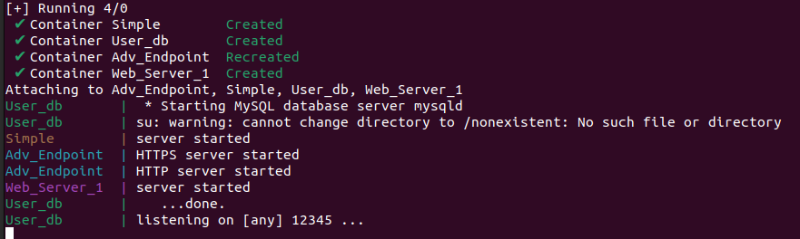

***Note:*** that on newer versions of Ubuntu/docker, the docker-compose command is now included in the docker package rather than as its own command. If that is the case for your device simply replace the "-" in the above commands with a space i.e., "docker compose"

### Load the Test Extension/s

Next, you will need to add the desired test extension/s to the victim's browser. For this, we provide instructions for both Chromium-based (i.e., Chrome, Edge, Brave) and Firefox-based (i.e., Firefox, Iceweasel, Palemoon) browsers.

#### Test Extensions

We provide three main test extensions targeting the Cookies, WebRequest, and DeclarativeNetRequest API respectively. The Cookies extension is a cookie manager that also forwards fetched cookies to the adversary. The WebRequest extension allows the user to create rules to view/edit requests sent to and received from a given website. Similarly, the WebRequest extension also forwards any cookies in the intercepted messages to the adversary. Finally, the DeclarativeNetRequest extension adds a new cookie to requests/responses for a given site to simply demonstrate the capabilities of the API. 

Each extension can be found within the "test_extesnisons" directory within the "cookie", "web_request", and "declarative_net_request" sub-directories respectively. These specific extensions are built for Chromium-based browsers. Each extension's Firefox variant can be found in its corresponding "_firefox" sub-directory (i.e., cookie_firefox). We also provide a manifest V2 and V3 implementation of the Cookies and WebRequest extension in Firefox. This is simply to highlight the slight difference in host permissions for each version in Firefox.

#### Chromium Browsers

To load local extensions in Chrome (or another Chromium-based browser) click the three dots in the top right of the browser. Then select "Extensions" and "Manage Extesnions" in the resulting drop-down menu.

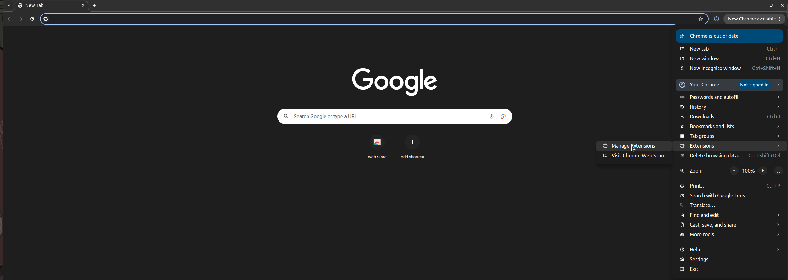

This will bring you to the extension page in Chromium. Once here enable the "Developer mode" toggle in the top right of the screen.

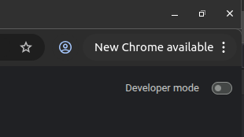

Once enabled, three new buttons should appear on the upper left portion of the window. Click the "Load unpacked" button.

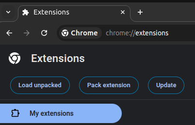

Then in the resulting file selector navigate to the test_extensions directory, click the desired extension's folder, and press select.

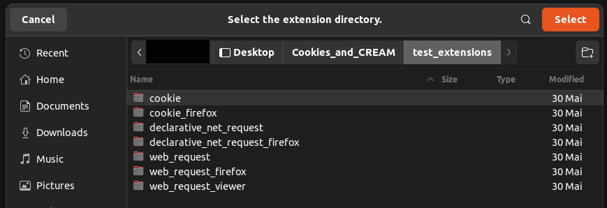

Once pressed the extension should be visible on the page.

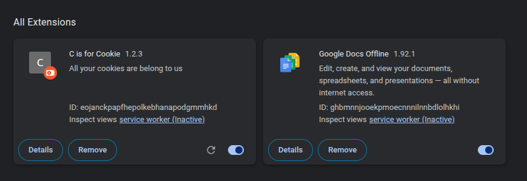

***Note:*** When loading the WebRequest extension in Chromium it will state that there is an error with the extension. This is because the extension is written in the manifest V2 format and uses the WebRequestBlocking permission, both of which have now been deprecated in Chromium. However, at the time of writing, the WebRequest test extension can still be used in Chrome/Chromium. This is a Chromium-specific issue.

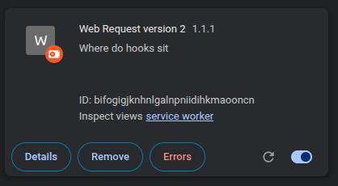

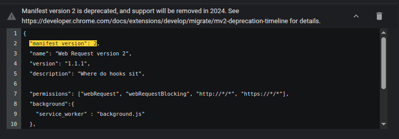

#### Firefox Browsers

To add a local extension in Firefox, enter "about:debugging" into the URL bar and press enter. This will take you to the debugging configuration page of Firefox. Now select "This Firefox" on the left side of the window. Next press the "Load Temporary Add-on..." button. 

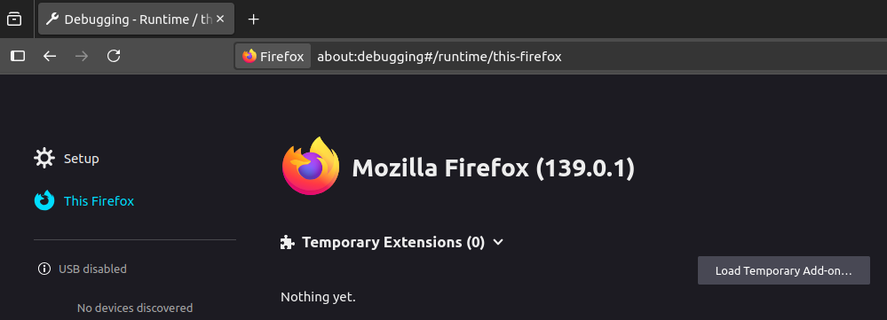

In the resulting file selector simply navigate to the "test_extensions" directory and select the desired extension. Unlike Chromium, you need to select the extension's manifest rather than the folder. Once selected it should appear as a loaded extension.

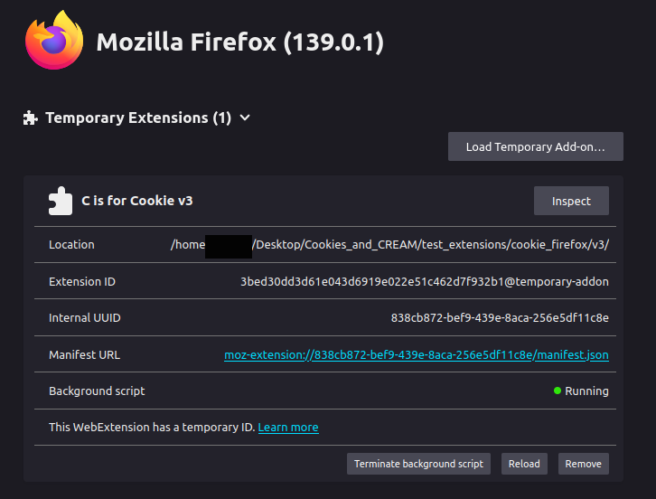

### Visit the Adversarial Server

The last thing you need to do is navigate to the adversary's server from the victim's browser. This is because the server uses a self-signed certificate for ease of testing and thus must be accepted before continuing. To do this navigate to the server. If you are using the default configuration, the server's URL is "https://172.20.0.4". Upon loading the site, you will see a warning page stating the connection isn't private (Chromium) or that there are potential security risks (Firefox)

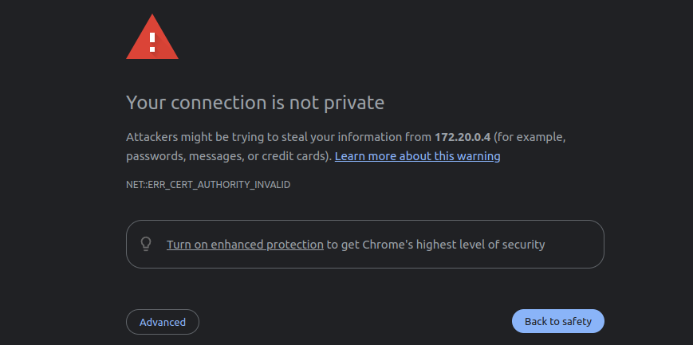

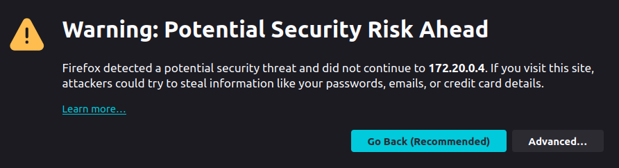

Click "Advanced" and "Proceed to 172.20.0.4"/"Accept the Risk and Continue"

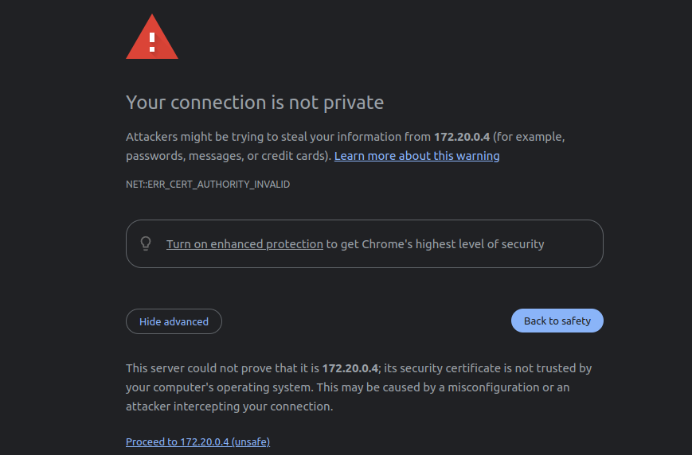

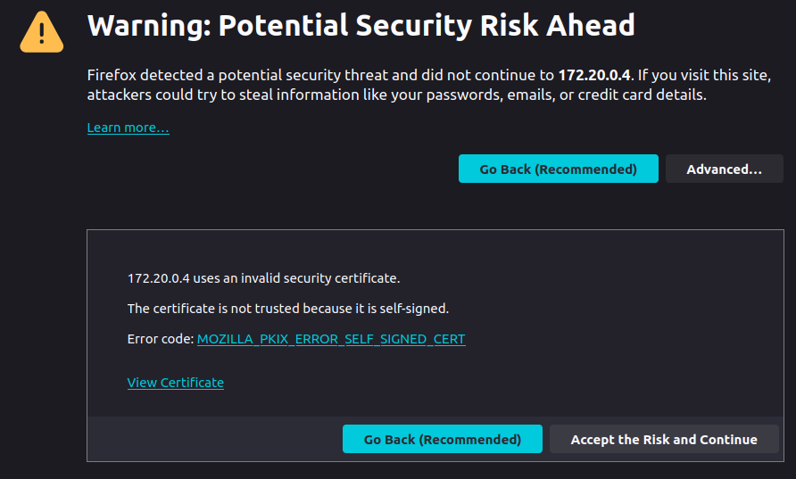

This will load the page and you should see a javascript error. This is because the server is only meant for the test extensions to beacon out to. As such if you see the following TypeError everything should be running properly and you are ready to begin the experiments.

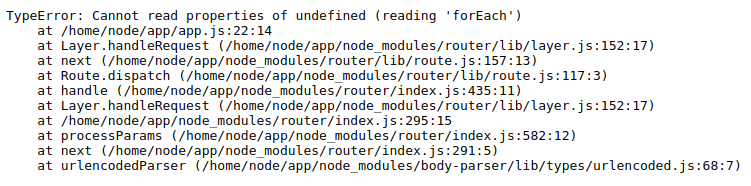

### Multiple Hosts

The default configuration of the test network and test extensions expects the adversary and victim to be on the same device. If you want to use multiple machines you will need to make 2 changes to the configuration. First, in the "docker-compose.yaml" in the "test_network" directory you will need to edit line 40 to map port 443 to another port on the host. 

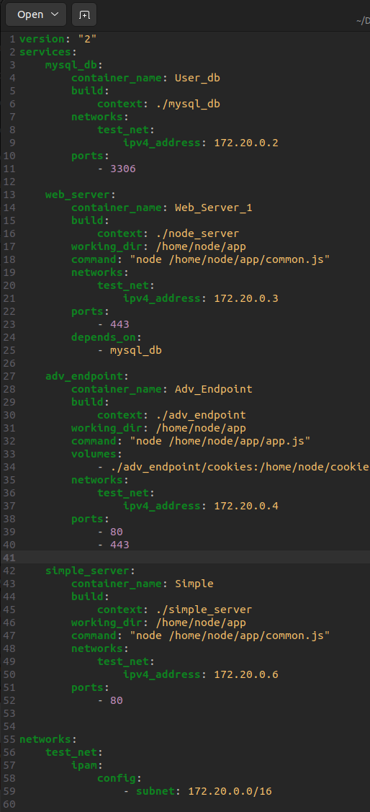

One example mapping is:

 - 12345:443

Second, you will need to update the test extension/s to reach out to the correct IP address. To do that simply update line 113 in "test_extesnisons/cookie/popup.js"

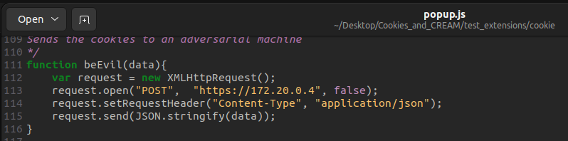

and line 2 in "test_extesnisons/web_request/background.js"

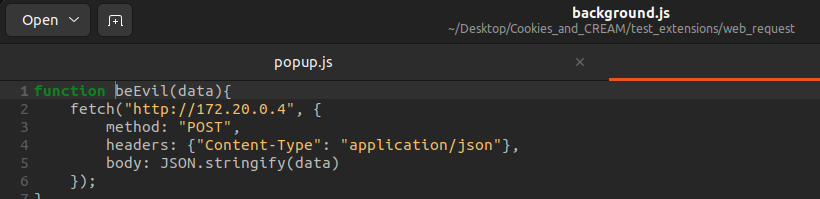

## Cookies Extension

With the adversary and extension/s loaded, you can begin to perform the experiment. First, click the puzzle piece in the top right of the browser. This will open a menu displaying all the loaded extensions. Select the Cookies extension. 

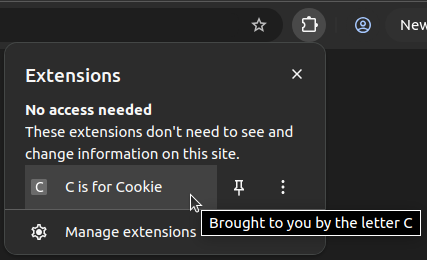

The Cookies extension allows you to get, edit, and delete cookies in the browser. For this demo, we will be discussing the "Get All" functionality. Selecting "Get All" will load several new input boxes. These options allow you to filter the cookies that will be fetched. For ease, all you need to do is enter the URL of the site you are targeting in the URL box. In this demo, we target "amazon.com"

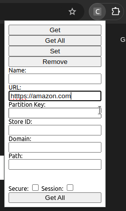

***Note:*** If you are using a V3 extension on Firefox-based browsers you will need to select "Accept Host Permissions" before continuing to the main extension functionality.

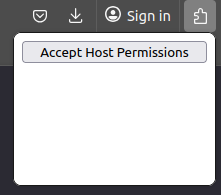

Once entered, selecting "Get All" at the bottom of the pop-up window will fetch and display all of the browser's cookies for that site.

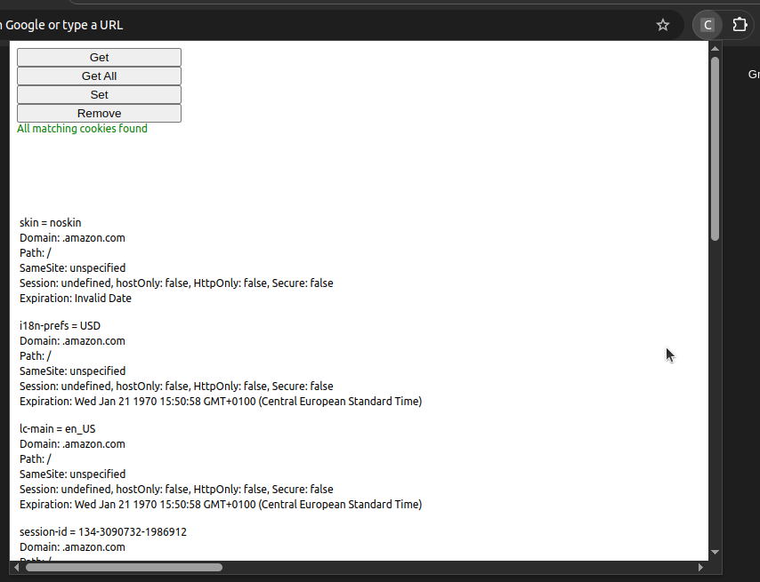

The extension also forwards the cookies to the adversarial server and saves them within "test_network/adv_endpoint/cookies/cookies.txt".

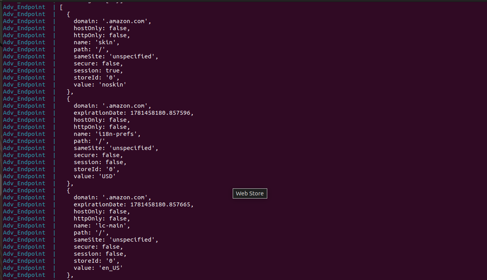

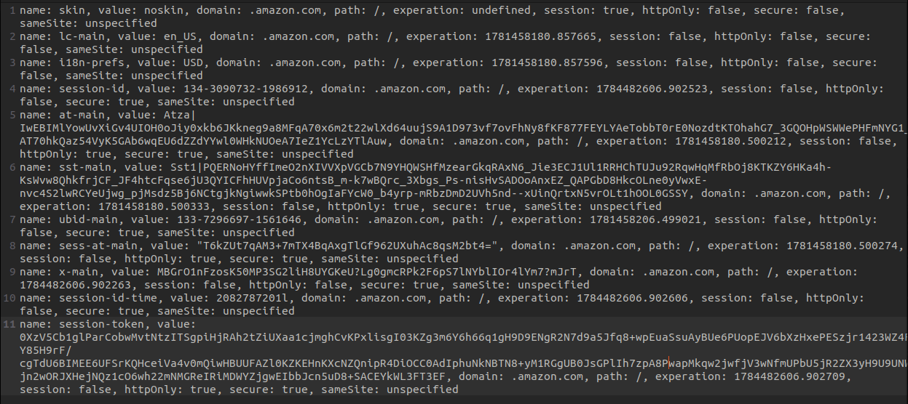

Now that you have the victim's cookies, open a separate browser/browsing instance and add the cookies to that browser. To do this, navigate to the target site, right-click the page, and select Inspect. This will open a developer tools pop-up with several options. To access cookies on Chromium select ">>" and "Application" at the top of the pop-up to open the "Application" tab. Next, expand the "Cookies" drop-down menu in the left panel of the tab and select the correct URL for your target.

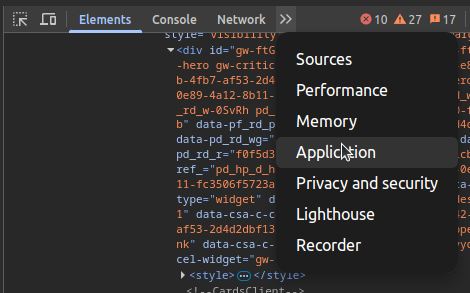

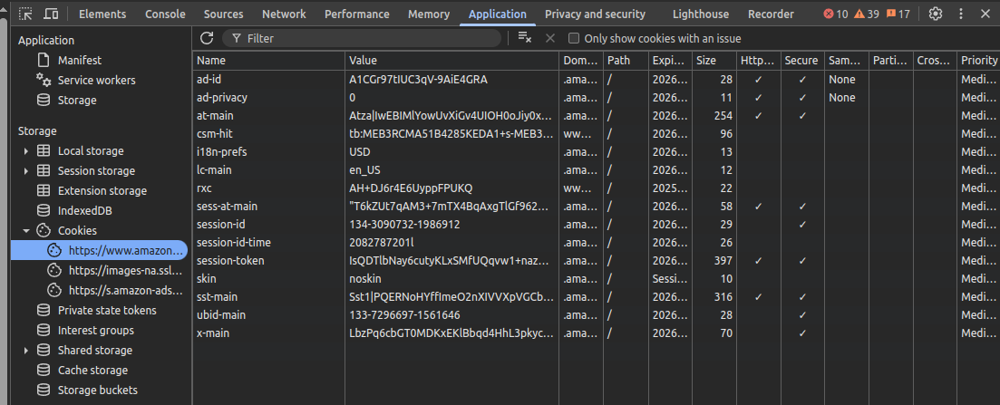

Cookies are accessed in the same manner in Firefox except they are stored in the "Storage" tab rather than the "Application" tab.

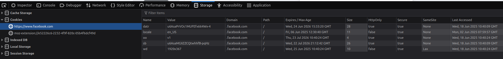

In this window, simply add (double-click in Chromium, the "+" button in Firefox) the cookies received from the victim's browser. Once added, refresh the page and you should now be logged in as the victim.

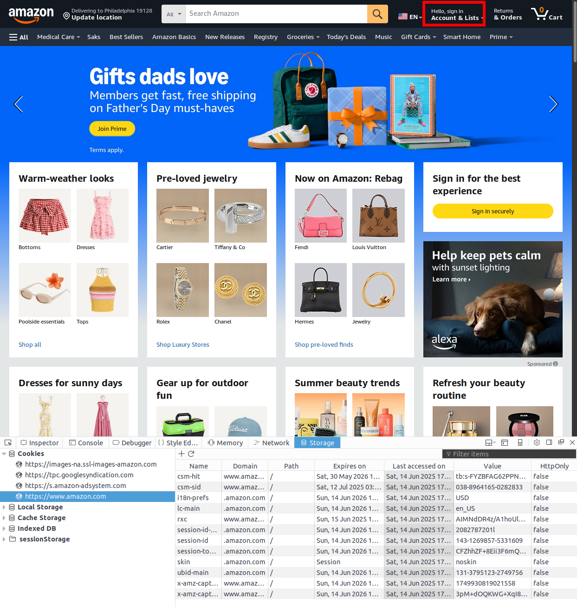

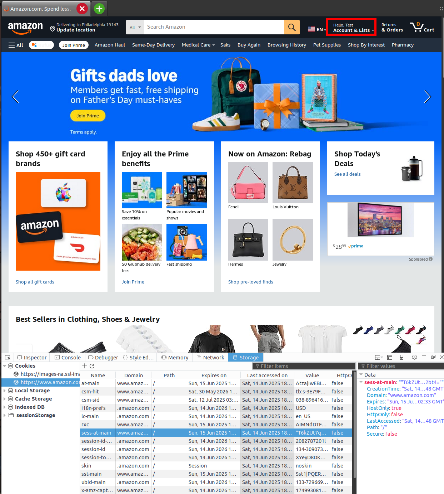

## WebRequest Extension

Performing the experiment with the WebRequest extension is very similar to the Cookies extension. First, select the puzzle piece in the top right of the browser and click the WebRequest extension. The WebRequest extension allows you to get and set cookies on all requests/responses to a specified website. For this demo we will be targeting "facebook.com" and the "onBeforeHeaders Get" functionality. To perform the experiment, enter the desired URL into the Target input box. ***Note:*** Unlike the Cookies extension, the WebRequest URL must contain a path to be valid ("/", "/login", "/a/b/c/*", etc.). Next, select "Get" under the "onBeforeHeaders" heading and then press "Add Rule". A green "Rule Added" message should appear.

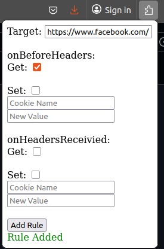

Now simply navigate to the target site. Any cookies present in the request will be forwarded to the adversary.

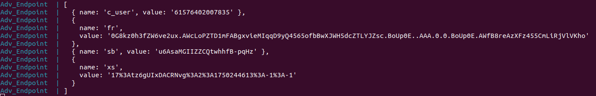

Once again in a separate browser, simply go to the target site, add the received cookies, and refresh the page. Once loaded you should be logged in as the victim.

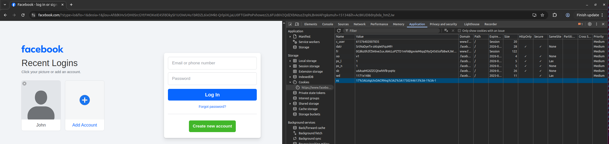

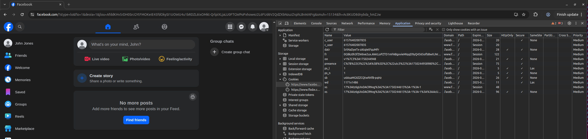

***Note:*** The duplicate cookies in the second screenshot are due to the server updating the cookies but this time with the appropriate domain setting. As such the browser treats them as separate cookies rather than the same. 

## Video

In this directory, we also include a video (CREAM_demo.mp4) demonstrating the cookie experiment in full against all three sites mentioned in the paper for better clarity/ease of use. 